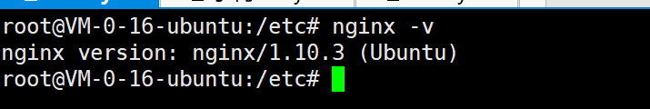

### ubuntu安装nginx
#### 一、apt-get安装nginx
#### 二、下载nginx包安装

ubuntu安装nginx
目前支持两种安装方式，一种是apt-get的方式，另一种是根据包安装的方式
为方便我统一使用root用户

#### 一、apt-get安装nginx
```
# 切换至root用户
sudo su root
apt-get install nginx
```


查看nginx是否安装成功
```
nginx -v
```

启动nginx
```
service nginx start
```


启动后，在网页重输入ip地址，即可看到nginx的欢迎页面。至此nginx安装成功


nginx文件安装完成之后的文件位置：

- /usr/sbin/nginx：主程序
- /etc/nginx：存放配置文件
- /usr/share/nginx：存放静态文件
- /var/log/nginx：存放日志


#### 二、下载nginx包安装
由于上面已经安装了nginx，所以我们先卸载nginx。再重新上传nginx包，解压下载。有输入提示时，输入Y即可

卸载apt-get安装的nginx

```
# 彻底卸载nginx
apt-get --purge autoremove nginx
#查看nginx的版本号
nginx -v
```


安装依赖包
```
apt-get install gcc
apt-get install libpcre3 libpcre3-dev
apt-get install zlib1g zlib1g-dev
# Ubuntu14.04的仓库中没有发现openssl-dev，由下面openssl和libssl-dev替代
#apt-get install openssl openssl-dev
sudo apt-get install openssl 
sudo apt-get install libssl-dev
```

安装nginx

```
cd /usr/local
mkdir nginx
cd nginx
wget http://nginx.org/download/nginx-1.13.7.tar.gz
tar -xvf nginx-1.13.7.tar.gz 
```


编译nginx

```
# 进入nginx目录
/usr/local/nginx/nginx-1.13.7
# 执行命令
./configure
# 执行make命令
make
# 执行make install命令
make install
```

启动nginx

```
#进入nginx启动目录
cd /usr/local/nginx/sbin
# 启动nginx
./nginx
```


访问nginx
网页输入ip地址，访问成功，到此，nginx安装完毕


### nginx 相关命令

```
nginx -t  # 验证配置文件；无法验证其它文件的情况
nginx -s reload # 重新加载；可以重启其它文件启动的情况
nginx -s stop # 快速停止
nginx -s quit  # 正常停止
nginx -V # 查看版本
nginx -c conf/web01.conf # 使用另一个配置文件
```

原文膜拜:

验证配置是否正确: nginx -t

查看Nginx的版本号：nginx -V

启动Nginx：start nginx

快速停止或关闭Nginx：nginx -s stop

正常停止或关闭Nginx：nginx -s quit

配置文件修改重装载命令：nginx -s reload

1、错误情况：

nginx: [error] CreateFile() "E:\nginx\nginx-1.9.3/logs/nginx.pid" failed

nginx: [error] Open() "E:\nginx\nginx-1.9.3/logs/nginx.pid" failed

 

使用命令创建/logs/nginx.pid文件: nginx -c conf/nginx.conf

 

相关文档说明:


http://www.cnblogs.com/wangkongming/p/4004416.html


http://www.cnblogs.com/xiaogangqq123/archive/2011/03/02/1969006.html

 

2、配置多个80端口 server：

 

相关文档说明:

http://os.51cto.com/art/201404/437182.htm


3、不同端口为本地nginx服务器配置多个站点：

相关文档说明:

http://blog.csdn.net/yongzhang52545/article/details/51282914

http://www.2cto.com/os/201411/355976.html


#### 2 编译 flv-module ssl
sudo ./configure --prefix=/usr/local/nginx --with-http_stub_status_module --with-http_ssl_module --add-module=/feinno/nginx/nginx-http-flv-module