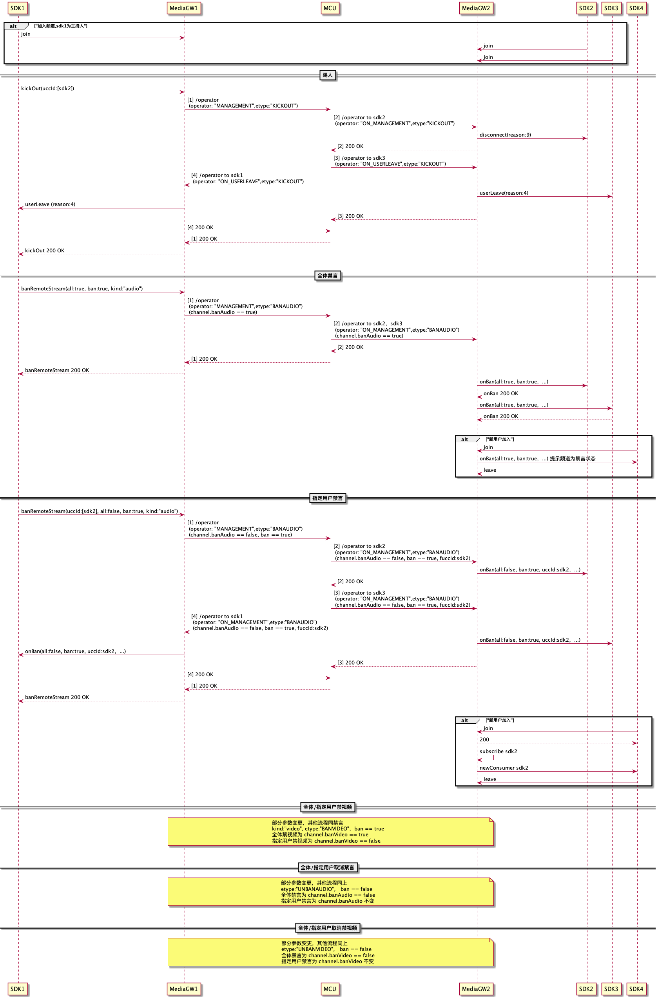

## 1 概要设计

### 1.1 禁言

#### 1.1.1 频道内禁言/解禁指定用户
##### 1.1.1.1 频道内禁言指定用户
- 当主持人A禁言某用户(可以指定多个)B后：
  
  1、用户B被禁言

  2、主持人A收到用户B被禁言

  3、其他用户收到用户B被禁言

##### 1.1.1.2 频道内解禁指定用户音频
- 当主持人A解禁某用户(可以指定多个)B后：
  
  1、用户B频道侧解禁

  2、主持人A收到频道侧用户B被解禁

  3、其他用户收到用户B被解禁


#### 1.1.2 频道内全体禁言/全体解禁
##### 1.1.2.1 频道内全体禁言
- 当主持人A禁言所有用户后：
  
  1、所有用户被禁言
  
  2、除主持人外所有用户收到频道禁言通知

  3、新用户加入， 不会收到频道禁言通知， 加入后是否倍禁言由业务模块决定。

##### 1.1.2.2 频道内全体解禁音频
- 当主持人A执行全体解禁后：
  
  1、所有用户频道侧解禁

  2、除主持人外所有用户收到频道解禁通知

### 1.2 禁视频

#### 1.2.1 频道内禁视频/解禁视频指定用户
##### 1.2.1.1 频道内禁指定用户视频
- 当主持人A关闭某用户(可以指定多个)B视频后：
  
  1、用户B被关掉视频

  2、主持人A收到用户B被关掉视频

  3、其他用户收到用户B被关掉视频


##### 1.2.1.2 频道内解禁指定用户视频
- 当主持人A解禁某用户(可以指定多个)B视频后：
  
  1、用户B频道侧解禁视频

  2、主持人A收到频道侧用户B视频被解禁

  3、其他用户收到用户B视频被解禁
  
#### 1.2.2 频道内全体禁视频/全体解禁视频
##### 1.2.2.1 频道内全体禁言
- 当主持人A禁所有用户视频后：
  
  1、所有用户视频被禁

  2、除主持人外所有用户收到频道禁视频通知

  3、新用户加入， 不会收到频道禁视频通知，加入后是否倍禁言由业务模块决定。

##### 1.2.2.2 频道内全体解禁视频
- 当主持人A执行全体解禁视频后：
  
  1、所有用户频道侧解禁视频

  2、除主持人外所有用户收到频道解禁视频通知

### 1.3 踢人

#### 1.2.1 频道内踢人
- 当主持人A踢掉用户(可以指定多个)B后：
  
  1、用户B被踢出会议

  2、主持人A收到用户B离开

  3、其他用户收到用户B离开


## 2 接口说明

### 2.1 请求和响应报文

- MCU与GW之间采用 http 进行交互。 

- GW向MCU发起的是 Post 请求，所有参数均使 用基于 UTF-8 编码内容均为 json 串。
- MCU向GW 发起请求时,发起 POST，所有参数均使用基于UTF-8 编码内容均为json 串。

### 2.2 频道内禁言/解禁

#### 2.2.1 SDK -> GW
- 接口功能：主持人发起频道内禁言/解禁单个用户， 全体禁言/解禁
- 方法：banRemoteStream

- 请求消息
  | 字段     | 类型       | 约束 | 描述       |
  | -------- | ---------- | ---- | ---------- |
  | uccIds | json数组     | 可选 | 禁言/解禁指定用户必填， 全体禁言/解禁时可不填写     |
  | all | boolean     | 可选 | true为全体， false时需要有uccId       |
  | kind  | String     | 必选 | audio为禁言/解禁， video为关闭摄像头/开启摄像头 |
  | ban  | boolean     | 必选 | true为禁言， false为解禁 |

- 请求样例

  ```json
  method: "banRemoteStream"
  data: {
      "uccIds": ["3345345","12333"],
      "all": false,
      "kind": "audio",
      "ban": true
  }
  ```
- 响应消息

  | 字段     | 类型       | 约束 | 描述                  |
  | -------- | ---------- | ---- | --------------------- |
  | state     | boolean     | 必选 | true:成功 false:失败 |
  | reason  | String     | 可选 | 失败原因，暂未定义好状态码，预留        |


- 返回样例

  ```json
  { 
      state:false, 
      reason:null
  }
  ```

#### 2.2.2 GW -> MCU 
- 接口功能：主持人发起频道内禁言/解禁单个用户， 全体禁言/解禁

 > POST https://serviceIp:port/srtc_smooth/mcu/operator

- 请求消息

  | 字段     | 类型       | 约束 | 描述       |
  | -------- | ---------- | ---- | ---------- |
  | operator | String     | 必选 | MANAGEMENT 管理功能     |
  | clientVer | String     | 必选 | 客户端版本       |
  | channel  | json对象     | 必选 | 详细见4  json结构 |
  | fucc     | json对象 | 必选 | 发送请求方用户信息       |
  | tucc     | json对象 | 可选 | 被操作方用户信息，tucc值为空对象表示频道操作【全体】，有具体的值，表示指定单人     |
  | tuccs     | tucc对象数组 | 可选 | 被操作方用户信息，指定多人     |
  | operdata     | json对象 | 必选 | 具体操作类型【详细见4  operdata结构】     |

- 请求样例：

  ```json
  {
      "operator": "MANAGEMENT",
      "clientVer": "v1.0.0",
      "channel": {
        "channelName": "32402340234",
      },
      "fucc": {
        "uccId":999
      },
      //指定（多人）
      "tuccs": [{
        "uccId":3345345,
      },{
        "uccId":12333,
      }],

      //指定（单人）
      "tucc": {
        "uccId":3345345,
      },
      //频道操作[全体] 为空对象
      //"tucc":{},

      "operdata": {
        //BANAUDIO【禁言】、BANVIDEO【禁视频】、UNBANAUDIO【取消禁言】、UNBANVIDEO【取消禁视频】、KICKOUT【踢人】
        "etype":"BANAUDIO", 
        //10: 频道操作  11:指定用户操作 
        "ereason": 11
      }
  }
  ```

- 响应消息

  | 字段     | 类型       | 约束 | 描述                  |
  | -------- | ---------- | ---- | --------------------- |
  | code     | String     | 必选 | 200成功，其他失败 |
  | message  | String     | 必选 | 描述信息              |
  | respTime | String     | 必选 | 响应时间戳            |


- 返回样例

  ```json
  {
      "code": 200,
      "message": "success",
      "respTime": "1630830230490",
  }
  ```

#### 2.2.3 MCU -> GW
- 接口功能：MCU向平台发起频道内禁言/解禁【自己被禁】

  > POST https://serviceIp:port/srtc_smooth/{serviceName}/operator 

- 请求消息

  | 字段     | 类型       | 约束 | 描述       |
  | -------- | ---------- | ---- | ---------- |
  | operator | String     | 必选 | ON_MANAGEMENT 管理功能通知   |
  | clientVer| String     | 必选 | 客户端版本       |
  | fservice | json对象     | 必选 | 详细见4  json结构       |
  | channel  | json对象     | 必选 | 详细见4  json结构 |
  | fucc     | json对象 | 必选 | 发送请求方用户信息       |
  | tucc     | json对象 | 可选 | 被操作方用户信息，全体禁言/解禁时可以不传     |
  | operdata     | json对象 | 必选 | 具体操作类型【详细见4  operdata结构】     |

- 请求样例：

  to 3345345  自己被禁
  ```json
  {
      "operator": "ON_MANAGEMENT",
      "clientVer": "v1.0.0",
      "fservice": {
        "serviceId": "10.10.10.11_MediaGW",
      },
      "channel": {
        "channelName": "32402340234",
      },
      "fucc": {
        "uccId":3345345
      },
      "tucc": {
        "uccId":3345345,
      },
      "operdata": {
        "etype":"BANAUDIO", 
        "ereason": 11
      }
  }
  ```

- 响应消息

  | 字段     | 类型       | 约束 | 描述                  |
  | -------- | ---------- | ---- | --------------------- |
  | code     | String     | 必选 | 200成功，其他失败 |
  | message  | String     | 必选 | 描述信息              |
  | respTime | String     | 必选 | 响应时间戳            |


- 返回样例

  ```json
  {
      "code": 200,
      "message": "success",
      "respTime": "1630830230490",
  }
  ```

  #### 2.2.4 GW -> SDK
- 接口功能：GW通知SDK禁言/解禁单个用户【自己被禁】

- 方法：onBan

- 请求消息
  | 字段     | 类型       | 约束 | 描述       |
  | -------- | ---------- | ---- | ---------- |
  | uccId | String     | 可选 | 禁言/解禁指定用户必填， 全体禁言/解禁时可不填写     |
  | all | boolean     | 可选 | true为全体禁言/解禁， false为指定禁言/解禁       |
  | kind  | String     | 必选 | audio为禁言/解禁， video为关闭/恢复摄像头 |
  | ban  | boolean     | 必选 | true为禁言/关闭摄像头， false为解禁/恢复摄像头 |

- 请求样例
  
  to 3345345  自己被禁
   ```json
  method: "onBan"
  data: {
      "uccId": "3345345",
      "all": false,
      "kind": "audio",
      ...
      "ban": true
  }
  ```
- 响应消息

  | 字段     | 类型       | 约束 | 描述                  |
  | -------- | ---------- | ---- | --------------------- |
  | state     | boolean     | 必选 | true:成功 false:失败 |
  | reason  | String     | 可选 | 失败原因，暂未定义好状态码，预留        |


- 返回样例

  ```json
  { 
      state:false, 
      reason:null
  }
  ```

  #### 2.2.5 MCU -> GW 
- 接口功能：MCU向平台发起通知远端禁言/解禁结果

  > POST https://serviceIp:port/srtc_smooth/{serviceName}/operator 

- 请求消息

  | 字段     | 类型       | 约束 | 描述       |
  | -------- | ---------- | ---- | ---------- |
  | operator | String     | 必选 | ON_MANAGEMENT 管理功能通知   |
  | clientVer| String     | 必选 | 客户端版本       |
  | fservice | json对象     | 必选 | 详细见4  json结构       |
  | channel  | json对象     | 必选 | 详细见4  json结构 |
  | fucc     | json对象 | 必选 | 发送请求方用户信息       |
  | tucc     | json对象 | 可选 | 被操作方用户信息，全体禁言/解禁时可以不传     |
  | operdata     | json对象 | 必选 | 具体操作类型【详细见4  operdata结构】    |

- 请求样例：

  to 3345345  远端12333被禁
  ```json
  {
      "operator": "ON_MANAGEMENT",
      "clientVer": "v1.0.0",
      "fservice": {
        "serviceId": "10.10.10.11_MediaGW",
      },
      "channel": {
        "channelName": "32402340234",
      },
      "fucc": {
        "uccId":12333, 
      },
      "tucc": {
        "uccId":3345345,
      },
      "operdata": {
        "etype":"BANAUDIO",
        "ereason": 11
      }
  }

  ```

- 响应消息

  | 字段     | 类型       | 约束 | 描述                  |
  | -------- | ---------- | ---- | --------------------- |
  | code     | String     | 必选 | 200成功，其他失败 |
  | message  | String     | 必选 | 描述信息              |
  | respTime | String     | 必选 | 响应时间戳            |


- 返回样例

  ```json
  {
      "code": 200,
      "message": "success",
      "respTime": "1630830230490",
  }
  ```

  #### 2.2.6 GW -> SDK 
- 接口功能：GW通知远端禁言结果

- 方法：onBan

- 请求消息
  | 字段     | 类型       | 约束 | 描述       |
  | -------- | ---------- | ---- | ---------- |
  | uccId | String     | 可选 | 禁言/解禁指定用户必填， 全体禁言/解禁时可不填写     |
  | all | boolean     | 可选 | true为全体禁言/解禁， false为指定禁言/解禁       |
  | kind  | String     | 必选 | audio为禁言/解禁， video为关闭/恢复摄像头 |
  | ban  | boolean     | 必选 | true为禁言/关闭摄像头， false为解禁/恢复摄像头 |


- 请求样例

  to 3345345  remote【12333】被禁
  ```json
  method: "onBan"
  data: {
      "uccId": "12333",
      "all": false,
      "kind": "audio",
      ...
      "ban": true
  }
  ```
- 响应消息

  | 字段     | 类型       | 约束 | 描述                  |
  | -------- | ---------- | ---- | --------------------- |
  | state     | boolean     | 必选 | true:成功 false:失败 |
  | reason  | String     | 可选 | 失败原因，暂未定义好状态码，预留        |


- 返回样例

  ```json
  { 
      state:false, 
      reason:null
  }
  ```
#### 2.2.7 redis结构
- 见2.0
- 
#### 2.2.8 流程图
- 见4 

### 2.3 频道内摄像头管理
- 与禁言流程一致， 其中需要修改operdata结构中的etype为VIDEO相关，详情查看4 operdata结构。
- kind字段为video。
- 全体禁视频：channel.banVideo=true; 指定用户禁言为 channel.banVideo=false。
- 流程图见4  

### 2.4 会议场景下提供主持人对频道内指定用户进行踢出

#### 2.4.1 SDK -> GW
- 接口功能：主持人对频道内指定用户进行踢出
- 说明：主持人踢出频道内指定用户；指定的用户收到服务端disconnect通知信令，reason为9，频道内其他用户收到userLeave通知，reason为4

- 请求消息
  | 字段     | 类型       | 约束 | 描述       |
  | -------- | ---------- | ---- | ---------- |
  | uccIds | json数组     | 必选 | 踢出指定用户， 必填|

- 请求样例
  ```json
  {
      "uccIds": ["3345345"]
  }
  ```
- 响应消息

  | 字段     | 类型       | 约束 | 描述                  |
  | -------- | ---------- | ---- | --------------------- |
  | state     | boolean     | 必选 | true:成功 false:失败 |
  | reason  | int     | 可选 | 失败原因，暂未定义好状态码，预留        |


- 返回样例

  ```json
  { 
      state:false, 
      reason:null
  }
  ```

#### 2.4.2 GW -> MCU
- 接口功能：主持人对频道内指定用户进行踢出

  > POST https://serviceIp:port/srtc_smooth/mcu/operator

- 请求消息

  | 字段     | 类型       | 约束 | 描述       |
  | -------- | ---------- | ---- | ---------- |
  | operator | String     | 必选 | 操作类型 MANAGEMENT 管理相关     |
  | clientVer | String     | 必选 | 客户端版本       |
  | channel  | json对象     | 必选 | 通道相关 |
  | fucc     | json对象 | 必选 | 发送请求方用户信息       |
  | tucc     | json对象 | 必选 | 被操作方用户信息     |
  | operdata | json对象 | 必选 | 事件内容     | 

- 请求样例：

  ```json
  {
      operator: "MANAGEMENT",
      clientVer: "v1.0.0",
      channel: {
          channelName: "32402340234",
      },
      fucc: {
          uccId:123135
      },
      tucc: {
          uccId:3345345
      },
      operdata:{
          etime:12312312312,
          etype:"KICKOUT",
          ereason:2,
      }
  }
  ```

- 响应消息

  | 字段     | 类型       | 约束 | 描述                  |
  | -------- | ---------- | ---- | --------------------- |
  | code     | String     | 必选 | 200成功，其他失败 |
  | message  | String     | 必选 | 描述信息              |
  | respTime | String     | 必选 | 响应时间戳            |


- 返回样例

  ```json
  {
      "code": 200,
      "message": "success",
      "respTime": "1630830230490",
  }
  ```

#### 2.4.3 MCU -> GW
- 接口功能：主持人对频道内指定用户进行踢出

  > POST https://serviceIp:port/srtc_smooth/{serviceName}/operator 

- 请求消息

  | 字段     | 类型       | 约束 | 描述       |
  | -------- | ---------- | ---- | ---------- |
  | operator | String     | 必选 | 操作类型 ON_MANAGEMENT 用户移除通知     |
  | clientVer | String     | 必选 | 客户端版本       |
  | fservice | json对象     | 必选 | 见4  json结构        |
  | channel  | json对象     | 必选 | 见4  json结构  |
  | tucc     | json对象 | 必选 | 见4  json结构   |
  | operdata | json对象 | 必选 | 见4  json结构     | 


- 请求样例：

  ```json
  {
      operator: "ON_MANAGEMENT",
      clientVer: "v1.0.0",
      channel: {
          channelName: "32402340234",
      },
      tucc: {
          uccId:3345345
      }
      operdata:{
          etime:12312312312,
          etype:"KICKOUT",
          ereason:2,
      }
  }
  ```

- 响应消息

  | 字段     | 类型       | 约束 | 描述                  |
  | -------- | ---------- | ---- | --------------------- |
  | code     | String     | 必选 | 200成功，其他失败 |
  | message  | String     | 必选 | 描述信息              |
  | respTime | String     | 必选 | 响应时间戳            |


- 返回样例

  ```json
  {
      "code": 200,
      "message": "success",
      "respTime": "1630830230490",
  }
  ```

  #### 2.4.4 GW -> SDK
- 接口功能：主持人对频道内指定用户进行踢出
- 方法名：disconnect
- 请求消息
  | 字段     | 类型       | 约束 | 描述       |
  | -------- | ---------- | ---- | ---------- |
  | code | int     | 必选 | MCU返回的code，200成功， 401:校验未通过      |
  | reason  | int     | 必选 | 原因-1:服务不可用 2:连接被中断 3:连接被服务端禁止 (一般为连接服务器失败) 4:加入频道失败 5:离开频道 6:appId无效 7:channelName无效 8:token无效 9:解散或被踢出频道 10:用户被服务器禁止 （一般为连接后被服务端断开） 11:不是合法的ChannelKey 12:主持人冲突 16:uccId无效或冲突 17:频道解散 18:平台踢人 |

- 请求样例
  ```json
  [{ 
      code: 1, 
      reason: 9,
  }]
  ```
- 响应消息
  notification 无响应消息

  #### 2.4.5 MCU -> GW
- 接口功能：MCU向平台发起通知远端指定用户被踢结果

  > POST https://serviceIp:port/srtc_smooth/{serviceName}/operator 

- 请求消息

  | 字段     | 类型       | 约束 | 描述       |
  | -------- | ---------- | ---- | ---------- |
  | operator | String     | 必选 | 操作类型 ON_USERLEAVE 用户离开通知    |
  | clientVer | String     | 必选 | 客户端版本       |
  | fservice | json对象     | 必选 | 见4  json结构          |
  | channel  | json对象     | 必选 | 见4  json结构    |
  | fucc     | json对象 | 必选 | 见4  json结构          |
  | tucc     | json对象 | 必选 | 见4  json结构       |
  | operdata | json对象 | 必选 | 见4  json结构        | 


- 请求样例：

  ```json
  {
      operator: "ON_USERLEAVE",
      clientVer: "v1.0.0",
      fservice: {
          serviceId: "10.10.10.11_MediaGW",
      },
      channel: {
          channelName: "32402340234",
      },
      fucc: {
          uccId:3345345,
          userProfile: 1,
          mobileInfo: "Chrome/iOS/Android",
          mobileVer: "Android6.0"
      },
      tucc: {
          uccId:123456
      }
      operdata:{
          etime:12312312312,
          etype:"KICKOUT",
          ereason:1,
      }
  }
  ```

- 响应消息

  | 字段     | 类型       | 约束 | 描述                  |
  | -------- | ---------- | ---- | --------------------- |
  | code     | String     | 必选 | 200成功，其他失败 |
  | message  | String     | 必选 | 描述信息              |
  | respTime | String     | 必选 | 响应时间戳            |


- 返回样例

  ```json
  {
      "code": 200,
      "message": "success",
      "respTime": "1630830230490",
  }
  ```

  #### 2.4.6 [GW -> SDK]通知远端指定用户被踢结果接口
- 接口功能：GW通知远端指定用户被踢结果结果

- 方法名：userLeave

- 请求消息
  | 字段     | 类型       | 约束 | 描述       |
  | -------- | ---------- | ---- | ---------- |
  | uccId  | long     | 必选 | 远端用户 ID |
  | userProfile | int     | 必选 | 远端用户角色，1:主持人，2:参与者，3:观众，4:哨兵       |				
  | mobileInfo |	string | 必选	| 远端用户客户端设备信息|
  | mobileVer |	string | 必选 |	远端用户客户端设备版本|
  | channelName |	string	|必选|远端用户所在房间 |
  | reason |	int	|必选|0:主动离开 1:失去通信 2:平台踢出 3:ID冲突 4:主持人踢人 5:主持人解散 |

- 请求样例
  ```json
  { 
      uccId: 6185, 
      userProfile:2,
      mobileInfo: "Android",
      mobileVer: "Android6.0",
      channelName: '333444',
      reason:3
  }
  ```
 - 响应消息  无需返回响应消息

#### 2.4.7 redis结构
- 见3
- 
#### 2.4.8 流程图
- 见5

## 3 Redis结构 - 沿用现有结构
### 3.1 用户数据
#### 3.1.1 用户绑定房间信息———房主与Channel绑定，每个房间不一定有房主，有房主的房间房主可以进行踢人，解散等操作。
```json
Key: MCU_Channel_Master_v2:{appID}:{channelName}
Value:
        {
        "channelName": "857857",
        "channelKey": "channelKey",
        "uccId": 555555,
        "userProfile": 2,
        "banAudio":false, //新加字段
        "banVideo":false //新加字段
        }
```

#### 3.1.2 用户与Service绑定———保存某个GW服务上当前所有的用户信息
```json
  Key: MCU_Channel_Master_v2:{appID}:{channelName}
  Value:
  Key： MCU_ServiceId_v2:{serviceId}
  Set：
      [
          {appId}_{uccId}
      ]
```
#### 3.1.3 房间绑定用户信息———将用户的信息和房间与mediaGW服务进行绑定
```json
Key: MCU_Channel_v2:{appID}:{channelName}
File:
    [
        {
            Key:{uccId}
            Value:
                {
                    "serviceId": "xxxx",
                    "uccId": "857857",
                    "userProfile": 2,
                    "audio":true,
                    "video":true,
                    "audioMute":false,
                    "videoMute":false,
                    "audioBan":false, //新加入字段
                    "videoBan":false, //新加入字段 平台禁用
                    "audioCreateTime":"",
                    "audioUnactiveDuration":"",
                    "audioLastUnactiveTime":"",
                    "videoCreateTime":"",
                    "videoUnactiveDuration":"",
                    "videoLastUnactiveTime":""
                }
        }
    ]
```

#### 3.1.4 设置用户个人信息——保存当前用户的个人属性信息
```json
  Key: MCU_UccIdInfo_v2:{appID}:{uccId}
  File:
      [
          { Key:{uccId}    Value:{uccId}  }，
          { Key:{channelName}    Value:{channelName}  }，
          { Key:{appID}    Value:{appID}  }，
          { Key:{serviceId}    Value:{serviceId}  }，
          { Key:{userProfile}    Value:{userProfile}  }，
          { Key:{mobileInfo}    Value:{mobileInfo}  }，
          { Key:{mobileVer}    Value:{mobileVer}  }
      ]
```

### 3.2 GW服务数据
#### 3.2.1 MediaGW服务注册信息，每一个在MCU中成功注册的MediaGW服务的信息都会保存
```json
Key：MCU_MediaService_v2
File:
    [
        {Key:{serviceId}
        Value:{
                  "serviceId":"serviceId",
                  "serviceIp":"serviceIp",
                  "servicePort":"servicePort",
                  "serviceName":"serviceName",
                  "serviceVer":"serviceVer",
                  "clusterGwName":"CLUSTERA",
                  "isRunning":true
                }
        }
    ]
```

#### 3.2.2 设置服务对远端映射本地信息设置服务对远端映射本地信息
```json
Key：MCU_MediaService_v2:{serviceId}:Local
File:
    [
        {Key:{toServiceId}
        Value:{
                "serviceId": "serviceId",
                "transportId": "transportId",
                "localIp": "localIp",
                "localPort": "localPort",
                "remoteIp": "remoteIp",
                "remotePort": "remotePort",
                "protocol": "protocol"
                }
        }
    ]
```

#### 3.2.3 设置服务对远端映射远端信息设置服务对远端映射远端信息
```json
Key：MCU_MediaService_v2:{serviceId}:Remote
File:
    [
        {Key:{toServiceId}
        Value:{
                "serviceId": "serviceId",
                "transportId": "transportId",
                "localIp": "localIp",
                "localPort": "localPort",
                "remoteIp": "remoteIp",
                "remotePort": "remotePort",
                "protocol": "protocol"
                }
        }
    ]
```

### 3.3 其他
#### 3.3.1 MCU房间分布式锁
```json
Key: MCU_Channel_Lock_v2:{appID}:{channelName}
Value:
        {"LOCK"}
```

### 4 Json数据结构

  channel对象结构
  | 字段     | 类型       | 约束 | 描述       |
  | -------- | ---------- | ---- | ---------- |
  | channelName | String     | 必选 | 房间号 |
  | banAudio | boolean     | 必选 | 频道操作，是否全部禁言  |
  | banVideo | boolean     | 必选 | 频道操作， 是否关闭所有摄像头 |

  fucc对象结构
  | 字段     | 类型       | 约束 | 描述       |
  | -------- | ---------- | ---- | ---------- |
  | uccId | String     | 必选 | 用户id |
  | audio | json对象     | 可选 | 音频信息 |
  | video | json对象     | 可选 | 视频信息 |
  | userProfile | String     | 可选 | 用户信息 |
  | mobileInfo | String     | 可选 | 终端信息 |
  | mobileVer | String     | 可选 | 终端版本 |


  audio对象结构
  | 字段     | 类型       | 约束 | 描述       |
  | -------- | ---------- | ---- | ---------- |
  | enable | boolean     | 必选 | 是否开启模块， 不开模块的时候，默认不接受远端的媒体流，本地也不发送。 |
  | mute | boolean     | 可选 | 可选， true为禁言， false为解禁， 是发布媒体流之后的操作 |
  | ban | boolean     | 必选 | 是否被禁言 |  

  video对象结构
  | 字段     | 类型       | 约束 | 描述       |
  | -------- | ---------- | ---- | ---------- |
  | enable | boolean     | 必选 | 是否开启模块， 不开模块的时候，默认不接受远端的媒体流，本地也不发送。 |
  | mute | boolean     | 可选 | 可选， true为禁言， false为解禁， 是发布媒体流之后的操作 |
  | ban | boolean     | 必选 | 是否被关闭视频 |  

  tucc对象结构
  | 字段     | 类型       | 约束 | 描述       |
  | -------- | ---------- | ---- | ---------- |
  | uccId | String     | 必选 | 用户id |

  operdata对象结构
  | 字段     | 类型       | 约束 | 描述       |
  | -------- | ---------- | ---- | ---------- |
  | etype | String     | 必选 | BANAUDIO【禁言】、BANVIDEO【禁视频】、UNBANAUDIO【取消禁言】、UNBANVIDEO【取消禁视频】、KICKOUT【踢人】 |
  | ereason | String     | 可选 | 2:平台踢出 3:ID冲突  4:主持人踢人  5: 解散频道  10:平台禁言  11:指定禁言|  
  | etime | String     | 可选 | 操作时间 |

  fservice
  | 字段     | 类型       | 约束 | 描述       |
  | -------- | ---------- | ---- | ---------- |
  | serviceId | String     | 必选 | 服务ID |

  ### 5 流程图
  